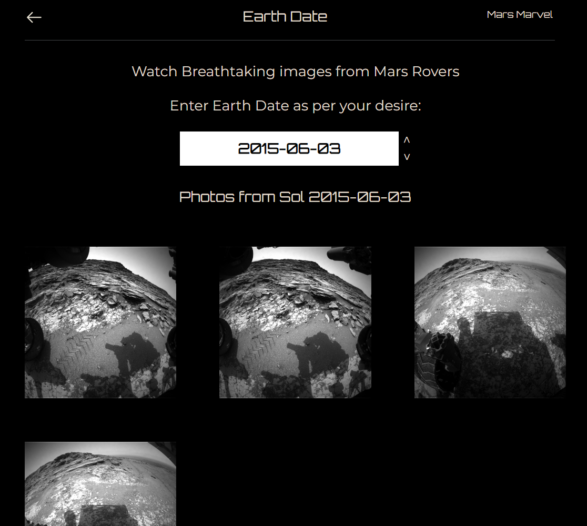

<h1>Mars Marvel</h1>

<h2>HIGH-LEVEL PROJECT SUMMARY</h2>
A dynamic web application, epitomizes the impact of open science by democratizing Mars research and exploration. Integrating real-time updates from Mars, it fosters a culture of public engagement and curiosity, promoting interdisciplinary research beyond traditional academia. As Earth's sustainability wavers, Mars Marvel serves as a pivotal platform, encouraging citizen scientists and amateur astronomers to explore potential Martian habitation. Utilizing open-source data from NASA's Mars API, the platform offers features from interactive chatbot to repositories promoting research. Mars Marvel showcases the potential of open science: a world where knowledge is accessible, collaboration is instinctive, and discovery knows no bounds.

<h2>LINK TO PROJECT VIDEO</h2>
<a href="https://youtu.be/o6UDfuNj9So?si=OYMI3X5CjUOJF1dg">https://youtu.be/o6UDfuNj9So?si=OYMI3X5CjUOJF1dg</a>

<h2>LINK TO PROJECT DEMO</h2>
<a href="https://mars-marvel.vercel.app/">https://mars-marvel.vercel.app/</a>

<h2>LINK TO GITHUB REPOSITORY</h2>
<a href="https://github.com/faizulislamfair/Mars-Marvel">https://github.com/faizulislamfair/Mars-Marvel</a>

 
 
<h2>DETAILED PROJECT DESCRIPTION</h2>

<h2>What is Mars Marvel?</h2>

 
Mars Marvel is a dynamic web application at the forefront of open science, revolutionizing our approach to Mars exploration. This platform seamlessly integrates real-time updates from the Red Planet, fostering a vibrant culture of public engagement and curiosity while promoting interdisciplinary research that extends beyond the confines of traditional academia. In a time when Earth's sustainability is in question, Mars Marvel emerges as a pivotal platform, beckoning citizen scientists, amateur astronomers, and enthusiasts to join in the quest for knowledge about potential Martian habitation. Leveraging open-source data from NASA's Mars API, it encompasses a rich array of features, including the Mars Rover Photos API for querying images captured by Martian rovers, and the Mars Weather Service API for real-time Martian weather updates. Additionally, users can explore the Martian landscape in detail through the Mars Trek WMTS API. Mars Marvel is a testament to the power of open science—a vision of a world where knowledge is universally accessible, collaboration is second nature, and the spirit of discovery knows no bounds.

 
<h2>How Does Mars Marvel Work?</h2>

<h2>Real-Time Weather Updates:</h2>

 
Keeping users informed about current weather conditions on Mars adds a dynamic and practical dimension to the platform. This information can be valuable for researchers and space enthusiasts. Mars Weather Service API from NASA Open APIs has been integrated here.
 
<h2>Chat & Voice Bot:</h2>
 

The chat and voice bot with pre-defined intent feature provides a user-friendly interface for accessing Mars information. Users can ask questions, seek explanations, and engage in conversations about Mars exploration, enhancing the overall user experience. Google’s Dialogflow framework has been integrated.
 

<h2>Research/ Paper/ Magazine on Mars:</h2>
 

One of the central pillars of Mars Marvel is its robust Mars Research Hub. Within this feature, users gain access to a vast repository of research papers, tools, and resources dedicated to advancing Mars exploration. Scientists, researchers, and enthusiasts can delve into a treasure trove of knowledge, collaborate on investigations, and explore the Mars magazine's insightful articles, interviews, and expert perspectives. This comprehensive Mars Research Hub not only facilitates access to collective Mars-related wisdom but also actively promotes research, fostering a culture of scientific curiosity and discovery within the community.

 
<h2>Research Papers:</h2>
 

Mars Marvel hosts a collection of research papers and repositories related to Mars exploration. This valuable resource enables scientists, researchers, and enthusiasts to access and contribute to the collective knowledge about Mars.
 

Papers from specific years are arranged accordingly and listed.

 

<h2>Promote Research:</h2>
 

The platform actively encourages and promotes research on Mars. It may offer tools and resources to help users conduct their investigations, fostering a culture of scientific inquiry and discovery.
 

<h2>Science Magazine Issues:</h2>
 

The Mars magazine offers in-depth articles, interviews, and features on various aspects of Mars exploration and research. It provides a platform for experts and enthusiasts to share their knowledge and perspectives.

 

<h2>Rover Mission Images:</h2>
 

Access to images captured by Mars rovers is essential for visualizing the Martian landscape and geological features. These images can be invaluable for research, education, and public engagement. All three of Mars Rover Photos API from NASA Open APIs have been integrated here.

 

<h2>Sol (Martian Day):</h2>
 

Users can query images based on 'Sol Martian Days,' allowing for a chronological exploration of the Martian landscape as experienced by the rovers.

 

<h2>Camera:</h2>
 

The 'Camera' category offers a glimpse into the world of Martian photography, showcasing images captured by specific rover cameras, each with its unique perspective.

 

 

<h2>Earth Date:</h2>
 

Users can access images based on 'Earth Date,' providing an alternative approach to navigating and appreciating the visual treasures from Mars. These categories collectively offer a rich visual experience, immersing users in the beauty and wonder of the Red Planet

 

<h2>Mars Trek WMTS:</h2>
 

The inclusion of Mars Trek Web Map Tile Service (WMTS) allows users to explore detailed maps of Mars, enhancing their ability to analyze and understand the planet's geography and topography. Mars Trek WMTS API from NASA Open APIs has been integrated.

 

<h2>Mars Quizzes:</h2>
 

Quizzes add an element of fun and education to the platform. Users can test their knowledge about Mars, space exploration, and related topics, further promoting public engagement and learning.
 

 

<h2>Public Valuable Feedback:</h2>
 

In the pursuit of excellence, feedback is the compass that guides our journey. Our 'Public Valuable Feedback Field' is a pivotal component of our project evaluation process, dedicated to understanding and harnessing the insights and sentiments of our valued users.

 

<h2>Mars Research Advancement Initiative:</h2>

 

Welcome to the Mars Research Advancement Initiative dedicated to promoting Mars research through a range of resources. Explore NASA's Mars exploration data and research papers, collaborate on Google Colab, and engage with our interactive chat and voice bot. Dive into a treasure trove of rover mission images and detailed Mars Trek maps. We value public surveys and feedback, embrace Mars art and culture, and support educational outreach. Join us in the quest for knowledge about Mars, as we facilitate research grants, provide real-time weather updates, and offer a Mars magazine to enhance public engagement and promote Mars exploration.

 

<h2>LOOKING TO THE FUTURE</h2>

 

At Mars Marvel, we take your feedback seriously. Through sentiment analysis, we assess public sentiments as positive, negative, or neutral. When positive sentiments reach 50% or more, we enhance or extend specific features to elevate your experience. Conversely, if negative sentiments exceed 50%, we update or consider retiring features to ensure your satisfaction. Neutral sentiments, also over 50%, are continually monitored. Features experiencing heavy traffic and guided by expert opinions are extended or upgraded. Public engagement shapes the future of Mars Marvel as we explore and discover together.

 

<h2>IMPACT & NEEDS</h2>
The potential number of people that Mars Marvel could impact is vast and could potentially reach 250 million+ considering youth and young generations
To take our innovation to the next step we want proper public feedback, expert opinions and committed technological collaboration

 

<h2>VISION</h2>
The vision of Mars Marvel is to revolutionize the future of NASA and the people of Earth by democratizing space exploration, fostering collaboration, and inspiring the next generation. This transformative platform not only accelerates scientific discovery on Mars but also brings the wonder of space closer to the hearts and minds of people worldwide

 

<h2>CODING LANGUAGES</h2>
<li>React.js</li>
<li>Python</li>
<li>JavaScript</li>
<li>Node.js</li>
 

<h2>TOOLS/SOFTWARE/MODELS:</h2>
<li>Pandas</li>
<li>Scikit-learn</li>
<li>TF-IDF Vectorizer</li>
<li>Logistic Regression</li>
<li>Google Colab</li>
<li>Express.js</li>
<li>Tailwind CSS</li>
<li>NASA Mars Open APIs</li>

 

<h2>HACKATHON JOURNEY</h2>
With the NASA Space Apps Challenge 2023 now concluded, the excitement that permeated the event is still vivid in our minds. We are proud to have been a part of this incredible experience and to have contributed to the global effort to explore the mysteries of space. As the hackathon came to a close, we reflected on the remarkable progress made and the innovative solutions created. Like many others from around the world, our team was actively engaged in brainstorming, coding, designing, and innovating during the hackathon. It was a bustling virtual space where brilliant minds tackled challenges that extended from Earth to the far reaches of our solar system. The connections forged with fellow space enthusiasts from across the globe will continue to inspire future collaborations. Although the hackathon has ended, the spirit of exploration and the drive to push the boundaries of our understanding of the universe will persist, ensuring that our cosmic journey remains an enduring endeavor.

 

<h2>REFERENCES</h2>
<b>3D MODEL</b>: <a href="https://mars.nasa.gov/gltf_embed/24881/">https://mars.nasa.gov/gltf_embed/24881/</a>  
<b>Open Source Science Initiative</b>:<a href="https://science.nasa.gov/open-science-overview"> https://science.nasa.gov/open-science-overview</a> 
<b>NASA Open APIs</b>:<a href="https://api.nasa.gov/"> https://api.nasa.gov/</a> 
<b>Mars Weather Service API</b>: <a href="https://mars.nasa.gov/insight/weather/">https://mars.nasa.gov/insight/weather/</a> 
<b>Mars Rover Photos | Sol</b>:<a href="https://api.nasa.gov/mars-photos/api/v1/rovers/curiosity/photos?sol=1000&api_key=DEMO_KEY"> https://api.nasa.gov/mars-photos/api/v1/rovers/curiosity/photos?sol=1000&api_key=DEMO_KEY</a> 
<b>Mars Rover Photos | Camera</b>: <a href="https://api.nasa.gov/mars-photos/api/v1/rovers/curiosity/photos?sol=1000&camera=fhaz&api_key=DEMO_KEY">https://api.nasa.gov/mars-photos/api/v1/rovers/curiosity/photos?sol=1000&camera=fhaz&api_key=DEMO_KEY</a> 
<b>Mars Rover Photos | Earth Date</b>: <a href="https://api.nasa.gov/mars-photos/api/v1/rovers/curiosity/photos?earth_date=2015-6-3&api_key=DEMO_KEY">https://api.nasa.gov/mars-photos/api/v1/rovers/curiosity/photos?earth_date=2015-6-3&api_key=DEMO_KEY</a> 
<b>Mars Trek WMTS</b>:<a href="https://trek.nasa.gov/tiles/apidoc/trekAPI.html?body=mars"> https://trek.nasa.gov/tiles/apidoc/trekAPI.html?body=mars</a>

 

<h2>TAGS</h2>
#OpenScience #OpenScienceOdyssey #Software #Mars #API #ResearchAssessment #NASA #NASAOpenAPIs
